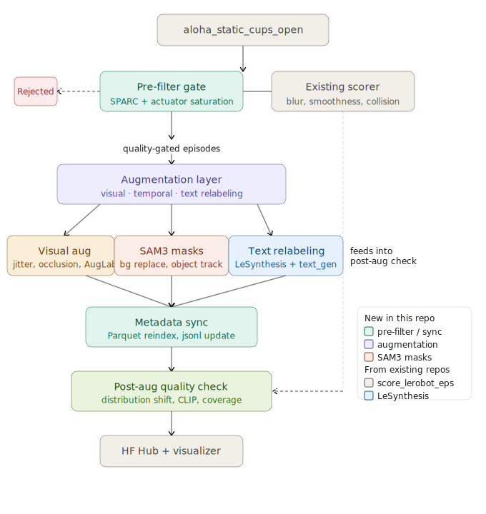

# aloha-augment

A dataset augmentation tool for [LeRobot v3](https://github.com/huggingface/lerobot) datasets. It quality-gates demonstrations, applies visual augmentation frame-by-frame, syncs all metadata, runs a post-augmentation quality report, and uploads the result directly to HuggingFace Hub with a one-click visualizer link.



---

## Quick start

```bash
pip install -e .

# Full end-to-end run: filter → augment → quality report → upload
aloha-augment full_run lerobot/aloha_static_cups_open ./output \
  --hf_repo_id myuser/aloha_cups_aug \
  --n_aug_copies 2 \
  --seed 42

# The tool prints a direct visualizer link on completion:
# https://huggingface.co/spaces/lerobot/visualize_dataset?path=%2Fmyuser%2Faloha_cups_aug%2Fepisode_0
```

Alternatively, just filter + augment without uploading:

```bash
aloha-augment run lerobot/aloha_static_cups_open ./output
```

---

## Available commands

| Command | Description |
|---|---|
| `full_run` | 7-stage end-to-end pipeline (filter → augment → sync → report → upload) |
| `run` | Filter + augment + sync only (no upload) |
| `report` | Print quality comparison table for an existing augmented output |
| `upload` | Upload an existing output directory to HF Hub |
| `extract_masks` | *(Plan B)* Extract SAM3 robot masks for all episodes |

---

## Pipeline stages

### Stage 1 — Pre-filter (`prefilter.py`)

Two complementary quality metrics gate which episodes move forward.

**SPARC (Spectral Arc Length)**
Measures motion smoothness by computing the arc length of the velocity frequency spectrum:

1. Per-joint velocity via `np.gradient` on joint positions.
2. `np.fft.rfft` on each velocity signal; magnitude spectrum normalized to peak = 1.
3. Arc length = `−∑ √((df/fc)² + Δa²)` averaged across joints.

Smooth motion decays rapidly in frequency space → short arc → score near 0.
Fragmented/jerky motion has energy at all frequencies → long arc → score << −10.

**Threshold choice: −10.0** At ~100 frames, smooth sinusoidal motion scores ≈ −3, while high-frequency noise scores −10 to −17. The −10 boundary reliably separates human-quality demonstrations from collisions, recoveries, and controller glitches.

**Actuator saturation** — `|action[t] − state[t+1]|` per joint. Fraction of timesteps exceeding 7° on any joint. Threshold: 0.15. Episodes above this indicate the controller was fighting against a rigid obstacle.

Scores are written to `output_dir/filter_scores.csv`.

### Stage 2 — Visual augmentation (`visual_aug.py`)

Each kept episode is copied `n_aug_copies` times with deterministic seeds.

**Color jitter** (BGR + HSV): brightness, contrast, hue shift, saturation multiplier.

| Parameter | Default range |
|---|---|
| Brightness | 0.8 – 1.2 |
| Contrast | 0.8 – 1.2 |
| Hue shift | −15° – +15° |
| Saturation | 0.8 – 1.2 |

**Occlusion patch**: a black rectangle (5%–20% of frame area) at a random position. Simulates partial occlusion by objects or the operator.

**AV1 codec handling**: the ALOHA dataset ships with AV1-encoded video. OpenCV cannot decode AV1. The pipeline detects the codec with `ffprobe` and transparently re-encodes to H.264 via `ffmpeg` before frame-level processing. Output is always written as H.264. All per-frame random parameters are logged to `aug_params` in each episode's metadata for full reproducibility.

### Stage 3 — SAM3 mask augmentation *(planned)*

Robot-arm mask extraction via SAM3's video predictor + background compositing with feathered edges. Use `--skip_sam3` (default) to skip.

### Stage 4 — Text relabeling *(planned)*

Gemini-powered task description variants preserving physical meaning. Use `--skip_text` (default) to skip.

### Stage 5 — Metadata sync (`metadata_sync.py`)

Keeps the dataset self-consistent after all augmentation:

| Function | What it updates |
|---|---|
| `rewrite_episode_parquet` | `episode_index`, `frame_index`, `index`; writes zstd-compressed Parquet |
| `update_meta_jsonl` | Filters to kept episodes, reindexes from 0, injects `aug_params` |
| `update_info_json` | `total_episodes`, `total_frames`, `total_videos`, `splits` |

A consistency check asserts that `info.json` episode count matches the JSONL line count before proceeding.

### Stage 6 — Quality report (`aug_metrics.py`)

Runs on a sample of up to 10 original and 10 augmented episodes and prints a rich table:

| Metric | PASS threshold | Why |
|---|---|---|
| SPARC delta | < 15% degradation | Ensures visual augmentation didn't introduce temporal jerkiness |
| Joint coverage ratio | > 1.05 | ConvexHull volume of last-3-joint angles — confirms new trajectory coverage |
| Affinity (CLIP) | ≥ 0.75 | Mean nearest-neighbour cosine similarity — augmented frames stay visually plausible |
| Diversity ratio (CLIP) | > 1.0 | Intra-set pairwise distance ratio — augmentation should increase visual spread |

CLIP metrics require `pip install -e ".[clip]"`. If `transformers` is not installed, CLIP columns are reported as N/A without failing.

The full report is written to `output_dir/augmentation_report.json`.

### Stage 7 — HuggingFace Hub upload (`upload.py`)

Validates that the output directory contains `meta/info.json`, `meta/episodes.jsonl`, `data/`, and `videos/`, then uploads via `huggingface_hub.HfApi().upload_folder()`. Prints:

```
Dataset uploaded to: https://huggingface.co/datasets/myuser/aloha_cups_aug
Visualizer:          https://huggingface.co/spaces/lerobot/visualize_dataset?path=%2Fmyuser%2Faloha_cups_aug%2Fepisode_0
```

Pass `--token` or set the `HF_TOKEN` environment variable.

---

## How I used AI coding agents to build this

This entire tool was built with [Claude Code](https://claude.ai/code) running in agentic mode.

The workflow:
1. **Architecture first** — I described the problem and asked Claude to draft three layered plan files (`Plan_A`, `Plan_B`, `Plan_C`) covering the full scope from foundation to upload. Claude explored the LeRobot dataset format, identified the right API surfaces (`LeRobotDataset`, `HfApi`), and returned a detailed plan with function signatures and algorithm sketches before writing a single line of code.

2. **Incremental implementation** — Claude implemented each plan file as a self-contained coding task: scaffold, pre-filter, visual augmentation, metadata sync, CLI, then the quality metrics and upload modules. Each step ended with `pytest` to catch regressions immediately.

3. **Debugging with context** — When the SPARC tests failed (step function didn't produce enough spectral variance), Claude probed the formula numerically inline, identified that random noise (not step functions) is the correct adversarial signal at T=100, and updated both the implementation and the tests to match the empirically validated threshold.

4. **Plan compliance checking** — After Plan A was complete, I asked Claude to cross-check the implementation against all three plan files before writing the README. It caught that the required HF upload + visualizer URL (Plan C) hadn't been implemented yet, and flagged it as the blocking deliverable.

The SVG architecture diagram (`aloha_augment_arhitecture.svg`) was created separately and embedded here.

---

## Project layout

```
src/aloha_augment/
  prefilter.py       # SPARC + saturation scoring, episode filtering
  visual_aug.py      # color jitter, occlusion, video I/O with AV1 handling
  metadata_sync.py   # Parquet reindex, JSONL update, info.json update
  aug_metrics.py     # CLIP affinity/diversity, joint coverage, SPARC comparison
  upload.py          # HF Hub upload + visualizer URL
  pipeline.py        # Fire CLI — full_run, run, report, upload, extract_masks
tests/
  test_prefilter.py
  test_metadata_sync.py
```

---

## Running tests

```bash
pip install -e ".[dev]"
pytest tests/ -v
```
